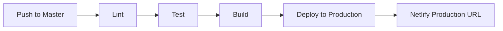
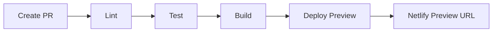
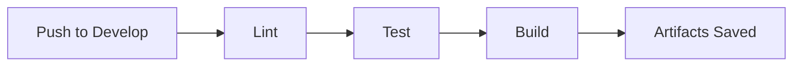

# 🚀 CI/CD Pipeline Kurulum Rehberi

Bu dokümantasyon, Wkt-Viewer projesi için CI/CD pipeline'ının nasıl kurulacağını adım adım açıklar.

## 📋 İçindekiler
1. [Pipeline Genel Bakış](#pipeline-genel-bakış)
2. [Netlify Kurulumu](#netlify-kurulumu)
3. [GitHub Secrets Yapılandırması](#github-secrets-yapılandırması)
4. [CI/CD Pipeline Akışı](#cicd-pipeline-akışı)
5. [Test ve Doğrulama](#test-ve-doğrulama)
6. [Troubleshooting](#troubleshooting)

---

## 🎯 Pipeline Genel Bakış

### Oluşturulan Dosyalar
1. **`netlify.toml`** - Netlify yapılandırma dosyası
2. **`.github/workflows/ci-cd.yml`** - GitHub Actions workflow dosyası
3. **`package.json`** - Build script'leri güncellendi

### Pipeline Aşamaları
```
Push/PR → Lint → Test → Build → Deploy (Netlify)
```

#### 1. 🔍 Lint Aşaması
- ESLint ile kod kalitesi kontrolü
- Prettier ile format kontrolü
- Hızlı geri bildirim

#### 2. 🧪 Test Aşaması
- Tüm unit testler (114 test)
- Code coverage raporu
- ChromeHeadless ile headless test

#### 3. 🏗️ Build Aşaması
- Production build (`ng build --configuration production`)
- Artifact olarak saklama
- Output: `dist/gis-viewer/`

#### 4. 🚀 Deploy Aşaması
- Master branch → Production deploy
- Pull Request → Preview deploy
- Otomatik yorum ve link

---

## 🌐 Netlify Kurulumu

### Adım 1: Netlify Hesabı Oluşturma
1. [netlify.com](https://www.netlify.com/) adresine gidin
2. GitHub hesabınızla giriş yapın
3. "Sign up with GitHub" seçeneğini kullanın

### Adım 2: Yeni Site Oluşturma

#### Yöntem A: Manuel Site Oluşturma (Önerilen)
1. Netlify dashboard'a gidin
2. "Add new site" → "Import an existing project" tıklayın
3. **VEYA** "Deploy manually" seçeneğini kullanın
4. Site oluşturulduktan sonra:
   - Site settings → Site details
   - **Site ID**'yi not alın (örn: `abc123-def456-ghi789`)

#### Yöntem B: Netlify CLI ile
```bash
# Netlify CLI kurulumu
npm install -g netlify-cli

# Login
netlify login

# Yeni site oluştur
netlify sites:create --name wkt-viewer

# Site ID'yi göster
netlify sites:list
```

### Adım 3: Netlify Authentication Token Alma
1. Netlify dashboard → User settings
2. "Applications" → "Personal access tokens"
3. "New access token" butonuna tıklayın
4. Token adı: `github-actions-deploy`
5. Token'ı kopyalayın ve güvenli bir yere kaydedin
6. ⚠️ **ÖNEMLİ**: Bu token sadece bir kez gösterilir!

### Adım 4: Site Ayarları (Opsiyonel)
1. Site settings → Build & deploy
2. "Build settings" kısmında şunlar zaten `netlify.toml`'de tanımlı:
   - Build command: `npm run build:prod`
   - Publish directory: `dist/gis-viewer`
3. "Continuous Deployment" ayarlarını kapatabilirsiniz (GitHub Actions kullanacağız)

---

## 🔐 GitHub Secrets Yapılandırması

### Gerekli Secrets
GitHub repository'nizde aşağıdaki secrets'ları tanımlamanız gerekiyor:

1. **NETLIFY_AUTH_TOKEN** - Netlify personal access token
2. **NETLIFY_SITE_ID** - Netlify site ID
3. **CODECOV_TOKEN** (Opsiyonel) - Codecov integration için

### Secrets Ekleme Adımları
1. GitHub repository'nize gidin
2. Settings → Secrets and variables → Actions
3. "New repository secret" tıklayın
4. Her bir secret'ı ekleyin:

#### NETLIFY_AUTH_TOKEN
```
Name: NETLIFY_AUTH_TOKEN
Value: <Adım 3'te aldığınız Netlify token>
```

#### NETLIFY_SITE_ID
```
Name: NETLIFY_SITE_ID
Value: <Adım 2'de aldığınız Site ID>
```

#### CODECOV_TOKEN (Opsiyonel)
```
Name: CODECOV_TOKEN
Value: <Codecov.io'dan alacağınız token>
```

### Secrets Doğrulama
```bash
# GitHub CLI ile kontrol (GitHub CLI gerektirir)
gh secret list
```

---

## 🔄 CI/CD Pipeline Akışı

### Master Branch Push


**Akış:**
1. Master branch'e kod push edilir
2. Lint aşaması çalışır (ESLint + Prettier)
3. Test aşaması çalışır (114 unit test)
4. Build aşaması çalışır (production build)
5. Deploy aşaması çalışır (Netlify production)
6. Commit'e deployment URL'i eklenir

**Beklenen Süre:** ~5-8 dakika

### Pull Request


**Akış:**
1. Pull Request oluşturulur
2. Lint aşaması çalışır
3. Test aşaması çalışır
4. Build aşaması çalışır
5. Preview deployment oluşturulur
6. PR'a preview URL'i yorum olarak eklenir

**Beklenen Süre:** ~5-8 dakika

### Develop Branch Push


**Akış:**
1. Develop branch'e kod push edilir
2. Lint, test ve build çalışır
3. Deploy edilmez, sadece build artifacts saklanır
4. Master'a merge öncesi doğrulama

---

## ✅ Test ve Doğrulama

### Lokal Test
Pipeline'ı test etmek için lokal olarak çalıştırın:

```bash
# 1. Lint kontrolü
npm run lint

# 2. Format kontrolü
npm run format -- --check

# 3. Test çalıştır
npm run test:ci

# 4. Production build
npm run build:prod

# 5. Build output kontrol
ls dist/gis-viewer
```

### İlk Deploy
1. Tüm değişiklikleri commit edin:
```bash
git add .
git commit -m "feat: add CI/CD pipeline with Netlify"
git push origin master
```

2. GitHub Actions sekmesine gidin
3. Workflow'un çalışmasını izleyin
4. Her aşamanın başarılı olduğunu kontrol edin

### Deployment Doğrulama
1. GitHub Actions'da "Deploy to Netlify" jobunu açın
2. Netlify deployment URL'ini bulun
3. URL'i tarayıcıda açın
4. Uygulamanın çalıştığını doğrulayın

### Preview Deploy Test
1. Yeni bir branch oluşturun:
```bash
git checkout -b feature/test-ci-cd
```

2. Küçük bir değişiklik yapın
3. Push ve PR oluşturun:
```bash
git add .
git commit -m "test: CI/CD preview"
git push origin feature/test-ci-cd
```

4. PR'da Netlify preview linkini kontrol edin

---

## 🔧 Troubleshooting

### Yaygın Sorunlar ve Çözümleri

#### 1. "NETLIFY_AUTH_TOKEN not found"
**Sorun:** GitHub Secrets tanımlanmamış

**Çözüm:**
- GitHub → Settings → Secrets → Actions
- NETLIFY_AUTH_TOKEN'ı ekleyin

#### 2. "NETLIFY_SITE_ID not found"
**Sorun:** Site ID yanlış veya eksik

**Çözüm:**
- Netlify → Site settings → Site details
- Site ID'yi kopyalayıp GitHub Secrets'a ekleyin

#### 3. "Build failed: Cannot find module"
**Sorun:** Dependencies eksik

**Çözüm:**
```bash
# package-lock.json'ı commit edin
git add package-lock.json
git commit -m "chore: add package-lock.json"
git push
```

#### 4. "Tests failed in CI"
**Sorun:** Lokal çalışan testler CI'da başarısız

**Çözüm:**
```bash
# CI environment'ı simüle edin
npm run test:ci

# ChromeHeadless sorunları için
# karma.conf.js'de customLaunchers kontrol edin
```

#### 5. "Netlify Deploy Timeout"
**Sorun:** Deploy 5 dakikadan uzun sürüyor

**Çözüm:**
- `ci-cd.yml`'de `timeout-minutes` değerini artırın:
```yaml
timeout-minutes: 10
```

#### 6. "Angular Routing 404"
**Sorun:** Netlify'da route'lar çalışmıyor

**Çözüm:**
- `netlify.toml` dosyasında redirect kuralı var mı kontrol edin:
```toml
[[redirects]]
  from = "/*"
  to = "/index.html"
  status = 200
```

### Log İnceleme
```bash
# GitHub Actions logs
# GitHub → Actions → İlgili workflow → Job details

# Netlify deploy logs
# Netlify → Deploys → İlgili deploy → Deploy log
```

---

## 📊 İzleme ve Optimizasyon

### Build Süresini Optimize Etme
1. **Cache kullanımı**: GitHub Actions'da npm cache zaten aktif
2. **Paralel jobs**: Lint ve test paralel çalışabilir (şu an sıralı)
3. **Incremental build**: Angular'ın incremental build özelliğini kullanın

### Bildirimler
1. **Slack entegrasyonu**: GitHub Actions → Slack
2. **Email bildirimleri**: GitHub Settings → Notifications
3. **Netlify notifications**: Netlify → Site settings → Build & deploy → Deploy notifications

### Metrikler
- **Build başarı oranı**: GitHub Actions → Insights
- **Deploy süresi**: Netlify → Site analytics
- **Test coverage**: Codecov dashboard

---

## 🎉 Sonuç

CI/CD pipeline başarıyla kuruldu! Artık:

✅ Her push'ta otomatik test
✅ Her push'ta otomatik build
✅ Master branch'te otomatik deploy
✅ PR'larda otomatik preview
✅ Kod kalitesi kontrolleri

### Sonraki Adımlar
1. Badge ekleyin README.md'ye
2. Codecov entegrasyonu
3. E2E testler ekleyin
4. Performance monitoring (Lighthouse CI)
5. Automated versioning (semantic-release)

### Pipeline Badge
README.md'ye eklemek için:
```markdown

[](https://app.netlify.com/sites/YOUR-SITE-NAME/deploys)
```

---

## 📞 Destek

Sorun yaşarsanız:
1. GitHub Issues açın
2. Pipeline loglarını paylaşın
3. Hata mesajlarını ekleyin

**İyi deploymentlar! 🚀**
