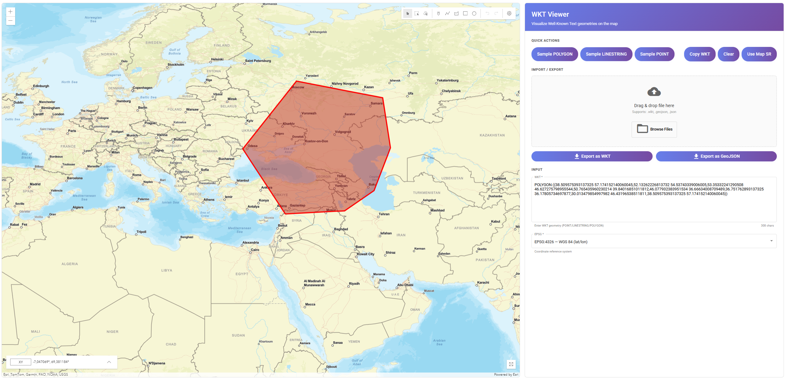

# Wkt-Viewer

Wkt-Viewer is a web application for visualizing Well-Known Text (WKT) geometries on an interactive map. Users can input WKT, select coordinate reference systems, and instantly see the geometry rendered using ArcGIS SDK for JavaScript. The app supports import/export of WKT and GeoJSON, and provides a modern UI for quick actions and file management.

## Features
- **Visualize WKT**: Enter WKT (POINT, LINESTRING, POLYGON, MULTIPOINT) and see it drawn on the map.
- **EPSG Selection**: Choose the coordinate reference system (e.g., EPSG:4326, EPSG:3857).
- **Import/Export**: Drag & drop or browse files (.wkt, .geojson, .json) to import geometries. Export current geometry as WKT or GeoJSON.
- **Quick Actions**: Paste sample geometries, copy WKT to clipboard, clear input, and use map’s spatial reference.
- **Edit Geometry**: Use ArcGIS Sketch tool to edit imported or drawn graphics directly on the map.

## Screenshot


## Technologies Used
- **Angular**: 13.3.2
- **ArcGIS SDK for JavaScript**: 4.26
- **RxJS**: 7.8.0
- **Angular Material**: 15.2.2
- **Proj4**: For coordinate reprojection

## Getting Started

### Prerequisites
- Node.js (v14+ recommended)
- npm

### Installation
```sh
git clone https://github.com/bsozer06/Wkt-Viewer.git
cd Wkt-Viewer
npm install
```

### Running the App
```sh
npm start
```
Open [http://localhost:4200](http://localhost:4200) in your browser.

### Testing
```sh
npm test
```

## Project Structure

```
src/
	app/
		components/
			map/         # Map display and editing
			wkt/         # WKT input and import/export
		helpers/       # Projection and WKT utilities
		services/      # Event, map, and layer management
		types/         # Type definitions
	assets/
	environments/
```

### Communication
Component communication is handled via `EventService` (RxJS Subjects). Angular Input/Output decorators are not used.

### Main Components
- **MapComponent**: Renders and edits map graphics
- **WktComponent**: Handles WKT input, import/export, and UI actions

### Helpers
- **ProjectionHelper**: Coordinate reprojection (ArcGIS & Proj4)
- **WktHelper**: WKT parsing and conversion

### Services
- **EventService**: Component communication
- **MapService**: Map initialization and management
- **LayerService**: Graphics layer management

### Types
- **WktForm**: WKT form model

## Contributing
Pull requests are welcome! For major changes, please open an issue first to discuss what you would like to change.

## Roadmap / TODOs
- Switch to NgRx for state management
- Support more file types (e.g., shapefile, GeoJSON)
- Enhance projection helper with Proj4
- Improve LayerService
- Add more geometry types and features
- Remove unnecessary comments and refactor code

## License
MIT
